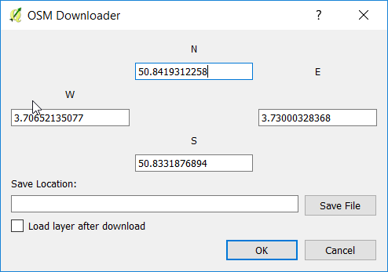
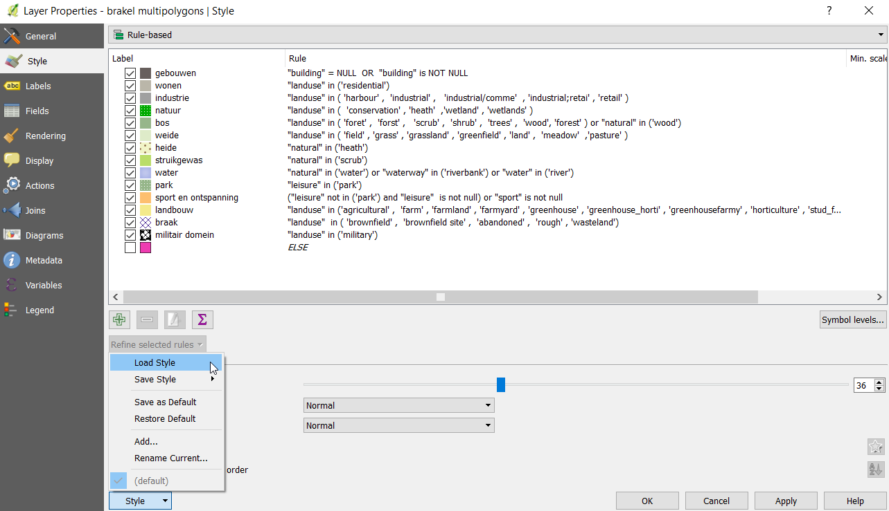

# Rendering OSM met QGIS

> Author : [brusspi](https://github.com/brusspi)

## 1/ download gegevens

- <http://download.geofabrik.de/europe/belgium.html> --- gans België
- of via QGIS-plugin osm-downloader (echter beperkt gebied) is zelfde file als JOSM
- of via JOSM (gelijkaardig gebied als met plugin)
- <https://extract.bbbike.org/> --- groter gebied dan met plugin

## 2/ gegevens inladen

### Postgis

- Meer info op: <http://learnosm.org/en/osm-data/osm2pgsql/>
- database voorbereiden:

```
create database osm;
create extension postgis;
create extension hstore;
```

- via commandline download inladen:

```
osm2pgsql -c -s -k -d osm -U postgres -H localhost -S C:\Users\pieter\Documents\GIS\_werkmap\osm\default.style C:\Users\pieter\Documents\GIS\_werkmap\osm\belgium-latest.osm.pbf
```

- Maak in QGIS connectie met database via 

### OSMdownloader

via plugin *OSMdownloader* (te installeren via QGIS > pluginmanager) download je rechtstreeks een gebied uit de centrale OSM-database.

- selecteer gebied met .  Een achtergrondkaart is handig/nodig



- vink *load layer* aan om direct in te laden. Indien je dit vergat (of nadien) kan je het bestand gewoon in je openstaande QGIS-project slepen.

- selecteer de gewenste gegevenstypes:


- sla indien gewenst de lagen op in een ander formaat (geojson, shapefile, etc).  Dit kan nodig zijn indien je extra kolommen wilt toevoegen met gegevens uit other\_tags.  Dit kan makkelijk met volgende query:

```
case
when strpos(other_tags, '"ref"')> 0
then		
left(		
right(other_tags, length(other_tags)-strpos(other_tags, '"ref"=>"')-(length('"ref"=>"')-1)),
strpos(right(other_tags, length(other_tags) - strpos(other_tags, '"ref"=>"') - length('"ref"=>"')),'"')
)
else ''
end
```

-> vervang &quot;ref&quot; door de gewenste andere tag, vb: &quot;maxspeed&quot;

## 3/ gegevens stijlen

### Voorgeprogammeerde stijlen

Je kan een stijl(.qml) inladen via *laageigenschappen* > tabblad stijl.  Links onderaan klikken op stijl > stijl laden.



## 4/ Stijl maken/aanpassen

Een stijl baseert zich op een waarde in een bepaalde kolom.  Welke kolommen er beschikbaar zijn, hangt af van de manier van downloaden.  Via osm2pgsql (PostGis) worden meer kolommen aangemaakt dan via de download met de plugin of bbbike.org.

Je kan zelf kolommen extraheren uit de kolom other_tags met behulp van onderstaand script:

```
case
when strpos(other_tags, '"ref"')> 0
then		
left(		
right(other_tags, length(other_tags)-strpos(other_tags, '"ref"=>"')-(length('"ref"=>"')-1)),
strpos(right(other_tags, length(other_tags) - strpos(other_tags, '"ref"=>"') - length('"ref"=>"')),'"')
)
else ''
end
```

-> vervang "ref" door de gewenste andere tag, vb: "maxspeed"

## 5/ Stijlen delen

- .qml
- <https://github.com/akbargumbira/qgis_resources_sharing>
